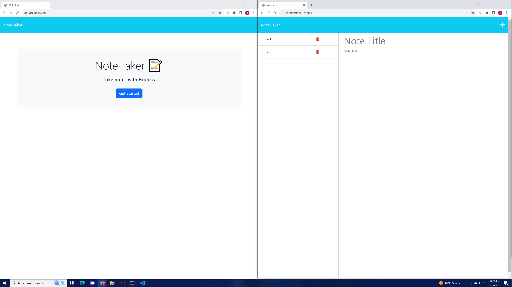

# Note Taker Application

## Badges

Click on the above license badge to be taken to the license link in your current browser!

## Table of Contents

  - [Badges](#badges)
  - [Description](#description)
  - [Installation](#installation)
  - [Usage](#usage)
  - [Credits](#credits)
  - [License](#license)

## Description

This web application is a Note Taking Applicaton. This project lets users save notes to a webpage where they can be updated, saved, and deleted.

Here is an image of what the project looks like: 

On the left side is the landing page for the application. The right side is where you can go to add and delete new notes.

## Installation

Everything should already be installed in order to run this application.

## Usage

In order to use this program, run npm start in the root directory. This will start an express server on your localhost which you can access by following the link in the terminal. From this point you can use the application as you please. 

If you would like to visit and use this application online without hosting it on your localhost, you can visit the deployed application at this link: https://fierce-crag-35886-d18da478add3.herokuapp.com/

## How to Contribute

If you created an application or package and would like other developers to contribute it, you can create a fork the corresponding GitHub Repo at https://github.com/CJFeagin33/. The repo name should be the same as the project title. For any other questions, feel free to reach out to me at cjfeagin33@gmail.com

## Tests

In order to test this program, after running npm start, you can add and delete notes on the /notes page. You will be able to see the db.json file update in real time as you add and delete new notes.

## Credits

The UCSD Fullstacks Web Developement Program provided starting code for this project. 

## License

None is this project's license. For more information about licenses, please visit https://docs.github.com/en/repositories/managing-your-repositorys-settings-and-features/customizing-your-repository/licensing-a-repository